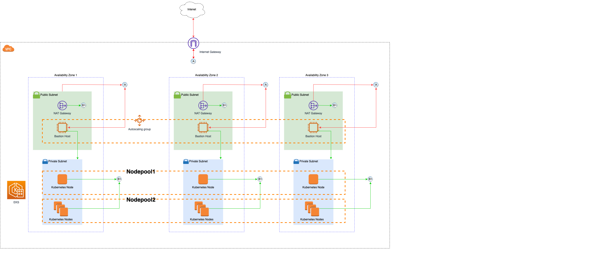

# Chainlink on EKS

## I) Kubernetes Architecture

#### Subnets
It mainly consists of a single VPC with two subnets within viz. `private` and `public`.
1. **Private Subnet**:

i. All the Kubernetes nodes (worker nodes) are a part of this private subnet.
ii. Nothing in the private subnet can be accessed directly over the Internet at this point i.e. no ingress.
iii. There might be a few instances when the node would want to communicate over the Internet e.g. update the k8s version of the node. The node can do so by accessing the NAT Gateway. There has to be a route in the VPC which will allow workloads in the private subnet to communicate with the NAT Gateway.
iv. The NAT Gateway is then connected to the Internet Gateway which opens up the doors to the Internet. Remember, the NAT Gateway works only in one direction, hence it allows traffic from the private subnet to the outside world, but no one can hit the NAT Gateway from the Internet.
 
2. **Public Subnet**

i. The Public subnet only includes two things viz., the NAT Gateway and the bastion host.
ii. Both of these are connected to the Internet Gateway.
iii. The Bastion host is simply used to access the ec2 instances (ssh) used as Kubernetes nodes. This should be a very rare and only admins should be allowed to do this. There should be a sec. group that allows connections from the bastion host to the VMs.

#### Kubernetes Nodes

Kubernetes nodes should be divided into two types of node pools
1. **Nodepool 1**

i. This should serve as the nodes where you run the blockchains e.g. Chainlink and Ethereum. No other workload should be scheduled on these nodes. The main reason to do this is to keep the node count down to 1. There are other sec. advantages of doing this. You can also choose the instance type that serves the best for running blockchains.
 
2. **Nodepool 2**

i. This is where your application pods will be running e.g. the adaptors. It's best to put this in an autocaling group so that they can scale as per cpu/memory requirement.

## References

1. https://aws.amazon.com/quickstart/architecture/amazon-eks/